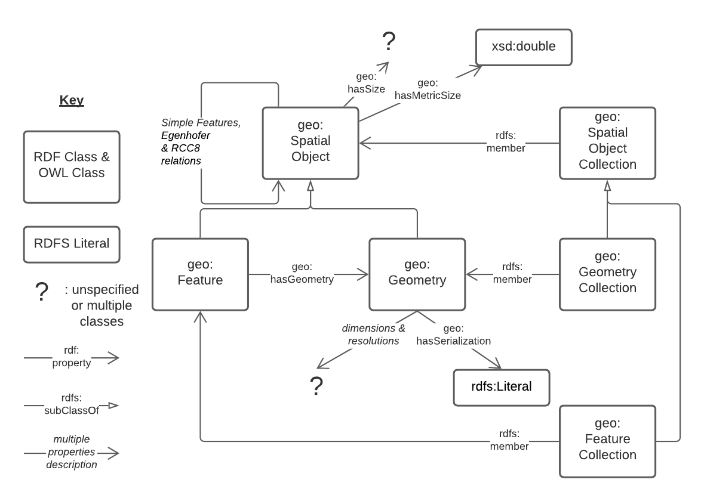

== Core

This clause establishes the *Core* Requirements class, with IRI `/req/core`, which has a corresponding Conformance Class, *Core*, with IRI `/conf/core`. These Requirements define a set of classes and properties for representing geospatial data. The resulting vocabulary - an ontology - can be used to construct SPARQL graph patterns for querying appropriately modeled geospatial data. The RDFS and OWL vocabularies have both been used so that the vocabulary can be understood by systems that support only RDFS entailment and by systems that support OWL-based reasoning.

The figure below gives an overview of the classes and properties defined by GeoSPARQL in the *Core*, *Topology Vocabulary Extension* and *Geometry Extension*, *Geometry Topology Extension* and *RDFS Entailment Extension* Conformance Classes. 

[#ont-overview]
.An overview of the Classes and Properties defined in GeoSPARQL. Where specific Classes and Properties are indicated, the prefixed forms of their ontology identifiers (IRIs) are given. Where types or collections of properties are given, they are described in italics. Where unspecified Classes are given, they are represented with a question mark. For cardinalities and other ontology restrictions, see the ontology document. Subproperties of `geo:hasSize`, its metric equivalent and `geo:hasSerialization` are not shown for clarity.


=== SPARQL

[#req_core_sparql-protocol]
|===
| *Req 1* Implementations shall support the SPARQL Query Language for RDF <<SPARQL>>, the SPARQL Protocol <<SPARQLPROT>> and the SPARQL Query Results XML <<SPARQLRESX>> and JSON <<SPARQLRESJ>> Formats.
| http://www.opengis.net/spec/geosparql/1.0/req/core/sparql-protocol[`http://www.opengis.net/spec/geosparql/1.0/req/core/sparql-protocol`]
|===

=== Classes

Two main classes are defined: <<Class: geo:SpatialObject, `geo:SpatialObject`>> and <<Class: geo:Feature, `geo:Feature`>>. 

Two container classes are defined: <<Class: geo:SpatialObjectCollection, Spatial Object Collection>> and <<Class: geo:FeatureCollection, Feature Collection>>. 

==== Class: geo:SpatialObject

The class http://www.opengis.net/ont/geosparql#SpatialObject[`geo:SpatialObject`] is defined by the following:

```turtle
geo:SpatialObject 
    a rdfs:Class, owl:Class ;
    rdfs:isDefinedBy geo: ;
    skos:prefLabel "Spatial Object"@en ;
    skos:definition "Anything spatial (being or having a shape, position or an extent)."@en ;
    skos:note "Subclasses of this class are expected to be used for instance data."@en ;
.
```
[#req_core_spatial_object_class]
|===
| *Req 2* Implementations shall allow the RDFS class <<Class: geo:SpatialObject, `geo:SpatialObject`>> to be used in SPARQL graph patterns.
|http://www.opengis.net/spec/geosparql/1.0/req/core/spatial-object-class[`http://www.opengis.net/spec/geosparql/1.0/req/core/spatial-object-class`]
|===

*Example:*

```turtle
eg:x 
    a geo:SpatialObject ;
     skos:prefLabel "Object X";
.
```

==== Class: geo:Feature

The class http://www.opengis.net/ont/geosparql#Feature[`geo:Feature`] is equivalent to the class `GFI_Feature` <<OGCOM>> <<ISO19156>> and is defined by the following:

```turtle
geo:Feature 
    a rdfs:Class, owl:Class ;
    rdfs:isDefinedBy geo: ;
    skos:prefLabel "Feature"@en ;
    rdfs:subClassOf geo:SpatialObject ;
    owl:disjointWith geo:Geometry ;
    skos:definition "A discrete spatial phenomenon in a universe of discourse."@en ;
    skos:note "A Feature represents a uniquely identifiable phenomenon, for example 
              a river or an apple. While such phenomena (and therefore the Features 
              used to represent them) are bounded, their boundaries may be crisp 
              (e.g., the declared boundaries of a state), vague (e.g., the 
              delineation of a valley versus its neighboring mountains), and change 
              with time (e.g., a storm front). While discrete in nature, Features 
              may be created from continuous observations, such as an isochrone 
              that determines the region that can be reached by ambulance within 
              5 minutes."@en ;
.
```

[#req_core_feature-class]
|===
| *Req 3* Implementations shall allow the RDFS class <<Class: geo:Feature, `geo:Feature`>> to be used in SPARQL graph patterns.
|http://www.opengis.net/spec/geosparql/1.0/req/core/feature-class[`http://www.opengis.net/spec/geosparql/1.0/req/core/feature-class`]
|===

==== Class: geo:SpatialObjectCollection

The class http://www.opengis.net/ont/geosparql#SpatialObjectCollection[`geo:SpatialObjectCollection`] is defined by the following:

```turtle
geo:SpatialObjectCollection
    a owl:Class ;
    rdfs:isDefinedBy geo: ;
    skos:prefLabel "Spatial Object Collection" ;
    skos:definition "A collection of individual Spatial Objects. This is the 
                    superclass of Feature Collection and Geometry Collection."@en ;  
    skos:note "This is the superclass of Feature Collection and Geometry Collection."@en ;              
    rdfs:subClassOf rdfs:Container ;
    rdfs:subClassOf [
        a owl:Restriction ;
        owl:allValuesFrom geo:SpatialObject ;
        owl:onProperty rdfs:member ;
    ] ;
.
```

Membership of the generic `rdfs:Container` that defines this class is restricted to instances of <<Class: SpatialObject, Spatial Object>>. `geo:SpatialObjectCollection` members are to be indicated with the `rdfs:member` property.

[#req_core_spatial-object-collection-class]
|===
| *Req 5* Implementations shall allow the RDFS class <<Class: geo:SpatialObjectCollection, `geo:SpatialObjectCollection`>> to be used in SPARQL graph patterns.
|http://www.opengis.net/spec/geosparql/1.1/req/core/spatial-object-collection-class[`http://www.opengis.net/spec/geosparql/1.1/req/core/spatial-object-collection-class`]
|===

==== Class: geo:FeatureCollection

The class http://www.opengis.net/ont/geosparql#FeatureCollection[`geo:FeatureCollection`] is defined by the following:

```turtle
geo:FeatureCollection
    a owl:Class ;
    rdfs:isDefinedBy geo: ;
    skos:prefLabel "Feature Collection" ;
    skos:definition "A collection of individual Features."@en ;
    rdfs:subClassOf geo:SpatialObjectCollection ;
    rdfs:subClassOf [
        a owl:Restriction ;
        owl:allValuesFrom :Feature ;
        owl:onProperty rdfs:member ;
    ] ;
.
```

Membership of the more general <<Class: SpatialObjectCollection, Spatial Object Collection>> that defines this class is restricted to instances of <<Class: Feature, Feature>>. `geo:FeatureCollection` members are to be indicated with the `rdfs:member` property.

[#req_core_feature-collection-class]
|===
| *Req 6* Implementations shall allow the RDFS class <<Class: geo:FeatureCollection, `geo:FeatureCollection`>> to be used in SPARQL graph patterns.
|http://www.opengis.net/spec/geosparql/1.1/req/core/feature-collection-class[`http://www.opengis.net/spec/geosparql/1.1/req/core/feature-collection-class`]
|===

=== Standard Properties for geo:SpatialObject

Properties are defined for associating Spatial Objects with scalar spatial measurements (sizes) .


[#req_geometry-extension_spatial-object-properties]
|===
| *Req 7* Implementations shall allow the properties 
<<Property: geo:hasSize, `geo:hasSize`>>,
<<Property: geo:hasMetricSize, `geo:hasMetricSize`>>,
<<Property: geo:hasLength, `geo:hasLength`>>, 
<<Property: geo:hasMetricLength, `geo:hasMetricLength`>>,
<<Property: geo:hasPerimeterLength, `geo:hasPerimeterLength`>>, 
<<Property: geo:hasMetricPerimeterLength, `geo:hasMetricPerimeterLength`>>, 
<<Property: geo:hasArea, `geo:hasArea`>>,
<<Property: geo:hasMetricArea, `geo:hasMetricArea`>>,
<<Property: geo:hasVolume, `geo:hasVolume`>> and
<<Property: geo:hasMetricVolume, `geo:hasMetricVolume`>>.
to be used in SPARQL graph patterns.
|http://www.opengis.net/spec/geosparql/1.1/req/core/spatial-object-properties[`http://www.opengis.net/spec/geosparql/1.1/req/core/spatial-object-properties`]
|===

==== Property: geo:hasSize

The property http://www.opengis.net/ont/geosparql#hasSize[`geo:hasSize`] is the superproperty of all properties that can be used to indicate the size of a Spatial Object in case (only) metric units (meter, square meter or cubic meter) cannot be used. If it is possible to express size in metric units, subproperties of <<Property: geo:hasMetricSize, `geo:hasMetricSize`>> should be used.
This property has no range specification. This makes it possible to use other vocabularies for expressions of size, for example vocabularies for units of measurement or vocabularies for specifying measurement quality.

GeoSPARQL 1.1 defines the following subproperties of this property: 
<<Property: geo:hasLength, `geo:hasLength`>>, 
<<Property: geo:hasPerimeterLength, `geo:hasPerimeterLength`>>, 
<<Property: geo:hasArea, `geo:hasArea`>> and 
<<Property: geo:hasVolume, `geo:hasVolume`>>.

```turtle
geo:hasSize 
    a rdf:Property, owl:ObjectProperty ;
    rdfs:isDefinedBy geo: ;
	rdfs:domain geo:SpatialObject ;
	skos:definition "Subproperties of this property are used to indicate the size of a 
                    Spatial Object as a measurement or estimate of one or more dimensions 
                    of the Spatial Object's spatial presence."@en ;
	skos:prefLabel "has size"@en ;
.
```

==== Property: geo:hasMetricSize

The property http://www.opengis.net/ont/geosparql#hasMetricSize[`geo:hasMetricSize`] is the superproperty of all properties that can be used to indicate the size of a Spatial Object using metric units (meter, square meter or cubic meter). Using a subproperty of this property is the recommended way to specify size, because using a standard unit of length (meter) benefits data interoperability and simplicity. Subproperties of <<Property: geo:hasSize, `geo:hasSize`>> can be used if more complex expressions are necessary, for example if the unit of length cannot be converted to meter, or if additional data are needed to describe the measurement or estimate of size.

GeoSPARQL 1.1 defines the following subproperties of this property: 
<<Property: geo:hasMetricLength, `geo:hasMetricLength`>>, 
<<Property: geo:hasMetricPerimeterLength, `geo:hasMetricPerimeterLength`>>, 
<<Property: geo:hasMetricArea, `geo:hasMetricArea`>> and 
<<Property: geo:hasMetricVolume, `geo:hasMetricVolume`>>.

```turtle
geo:hasMetricSize 
    a rdf:Property, owl:DatatypeProperty ;
    rdfs:isDefinedBy geo: ;
	rdfs:domain geo:SpatialObject ;
	rdfs:range xsd:double ;
	skos:definition "Subproperties of this property are used to indicate the size of a 
                    Spatial Object, as a measurement or estimate of one or more dimensions 
                    of the Spatial Object's spatial presence. Units are always metric 
                    (meter, square meter or cubic meter)."@en ;                  
	skos:prefLabel "has metric size"@en ;
.
```

==== Property: geo:hasLength

The property http://www.opengis.net/ont/geosparql#hasLength[`geo:hasLength`] can be used to indicate the length of a Spatial Object if it is not possible to use the property <<Property: geo:hasMetricLength, `geo:hasMetricLength`>>. It is a subproperty of <<Property: geo:hasSize, `geo:hasSize`>>.

```turtle
geo:hasLength 
    a rdf:Property, owl:ObjectProperty ;
    rdfs:isDefinedBy geo: ;
	rdfs:subPropertyOf geo:hasSize ;
	rdfs:domain geo:SpatialObject ;    
	skos:definition "The length of a Spatial Object."@en ;
	skos:prefLabel "has length"@en ;
.
```

==== Property: geo:hasMetricLength

The property http://www.opengis.net/ont/geosparql#hasMetricLength[`geo:hasMetricLength`] can be used to indicate the length of a Spatial Object in meters (m). It is a subproperty of <<Property: geo:hasMetricSize, `geo:hasMetricSize`>>. This property can be used for Spatial Objects having one, two, or three dimensions.

```turtle
geo:hasMetricLength 
    a rdf:Property, owl:DatatypeProperty ;
    rdfs:isDefinedBy geo: ;
	rdfs:subPropertyOf geo:hasMetricSize ;
	rdfs:domain geo:SpatialObject ;
	rdfs:range xsd:double ;    
	skos:definition "The length of a Spatial Object in meters."@en ;
	skos:prefLabel "has length in meters"@en ;
.
```

==== Property: geo:hasPerimeterLength

The property http://www.opengis.net/ont/geosparql#hasPerimeterLength[`geo:hasPerimeterLength`] can be used to indicate the length of the outer boundary of a Spatial Object if it is not possible to use the property <<Property: geo:hasMetricPerimeterLength, `geo:hasMetricPerimeterLength`>>. It is a subproperty of <<Property: geo:hasSize, `geo:hasSize`>>.

```turtle
geo:hasPerimeterLength
    a rdf:Property, owl:ObjectProperty ;
    rdfs:isDefinedBy geo: ;
	rdfs:subPropertyOf geo:hasSize ;
	skos:definition "The length of the perimeter of a Spatial Object."@en ;
	skos:prefLabel "has perimeter length"@en ;
.
```

==== Property: geo:hasMetricPerimeterLength

The property http://www.opengis.net/ont/geosparql#hasMetricPerimeterLength[`geo:hasMetricPerimeterLength`] can be used to indicate the length of the outer boundary of a Spatial Object in meters (m). It is a subproperty of <<Property: geo:hasMetricSize, `geo:hasMetricSize`>>. Circumference is considered a type of perimeter, so this property can be used for circular or curved objects too. This property can be used for Spatial Objects having two or three dimensions.

```turtle
geo:hasMetricPerimeterLength
    a rdf:Property, owl:DatatypeProperty ;
    rdfs:isDefinedBy geo: ;
	rdfs:subPropertyOf geo:hasMetricSize ;
	rdfs:domain geo:SpatialObject ;
	rdfs:range xsd:double ;    
	skos:definition "The length of the perimeter of a Spatial Object in meters."@en ;
	skos:prefLabel "has perimeter length in meters"@en ;
.
```

TIP: A consistency check can be applied to Geometry instances indicating both this property and the property <<Property: geo:dimension, `geo:dimension`>>: if supplied, the <<Property: geo:dimension, `geo:dimension`>> property's range value must be the literal integer 2 or 3. The following SPARQL query will return `true` if applied to a graph where this is not the case for all Geometries:

```sparql
    PREFIX geo: <http://www.opengis.net/ont/geosparql#>
    ASK 
    WHERE {
        ?g geo:hasMetricPerimeterLength ?p ;
           geo:dimension ?d .
            
        FILTER (?d < 2)
    }
```


==== Property: geo:hasArea

The property http://www.opengis.net/ont/geosparql#hasArea[`geo:hasArea`] can be used to indicate the area of a Spatial Object if it is not possible to use the property <<Property: geo:hasMetricArea, `geo:hasMetricArea`>>. It is a subproperty of <<Property: geo:hasSize, `geo:hasSize`>>.

```turtle
geo:hasArea
    a rdf:Property, owl:ObjectProperty ;
    rdfs:isDefinedBy geo: ;
	rdfs:subPropertyOf geo:hasSize ;
	rdfs:domain geo:SpatialObject ;    
	skos:definition "The area of a Spatial Object."@en ;
	skos:prefLabel "has area"@en ;
.
```

==== Property: geo:hasMetricArea

The property http://www.opengis.net/ont/geosparql#hasMetricArea[`geo:hasMetricArea`] can be used to indicate the area of a Spatial Object in square meters (m^2^). It is a subproperty of <<Property: geo:hasMetricSize, `geo:hasMetricSize`>>. This property can be used for Spatial Objects having two or three dimensions.

```turtle
geo:hasMetricArea
    a rdf:Property, owl:DatatypeProperty ;
    rdfs:isDefinedBy geo: ;
	rdfs:subPropertyOf geo:hasMetricSize ;
	rdfs:domain geo:SpatialObject ;
	rdfs:range xsd:double ;    
	skos:definition "The area of a Spatial Object in square meters."@en ;
	skos:prefLabel "has area in meters"@en ;
.
```
TIP: A consistency check can be applied to Geometry instances indicating both this property and the property <<Property: geo:dimension, `geo:dimension`>>: if supplied, the <<Property: geo:dimension, `geo:dimension`>> property's range value must be the literal integer 2 or 3. The following SPARQL query will return `true` if applied to a graph where this is not the case for all Geometries:

```sparql
    PREFIX geo: <http://www.opengis.net/ont/geosparql#>

    ASK 
    WHERE {
        ?g geo:hasMetricArea ?a ;
           geo:dimension ?d .
            
        FILTER (?d < 2)
    }
```

==== Property: geo:hasVolume

The property http://www.opengis.net/ont/geosparql#hasVolume[`geo:hasVolume`] can be used to indicate the volume of a Spatial Object if it is not possible to use the property <<Property: geo:hasMetricVolume, `geo:hasMetricVolume`>>. It is a subproperty of <<Property: geo:hasSize, `geo:hasSize`>>.

```turtle
geo:hasVolume
    a rdf:Property, owl:ObjectProperty ;
    rdfs:isDefinedBy geo: ;
	rdfs:subPropertyOf geo:hasSize ;
	rdfs:domain geo:SpatialObject ;    
	skos:definition "The volume of a three-dimensional Spatial Object."@en ;
	skos:prefLabel "has volume"@en ;
.
```

==== Property: geo:hasMetricVolume

The property http://www.opengis.net/ont/geosparql#hasMetricVolume[`geo:hasMetricVolume`] can be used to indicate the volume of a Spatial Object in cubic meters (m^3^). It is a subproperty of <<Property: geo:hasMetricSize, `geo:hasMetricSize`>>. This property can be used for Spatial Objects having three dimensions.

```turtle
geo:hasMetricVolume
    a rdf:Property, owl:DatatypeProperty ;
    rdfs:isDefinedBy geo: ;
	rdfs:subPropertyOf :hasMetricSize ;
	rdfs:domain geo:SpatialObject ;
	rdfs:range xsd:double ;    
	skos:definition "The volume of a Spatial Object in cubic meters."@en ;
	skos:prefLabel "has area in meters"@en ;
.
```
TIP: A consistency check can be applied to Geometries indicating both this property and the property <<Property: geo:dimension, `geo:dimension`>>: if supplied, the property <<Property: geo:dimension, `geo:dimension`>> property's range value must be the literal integer 3. The following SPARQL query will return `true` if applied to a graph where this is not the case for all Geometries:

```sparql
    PREFIX geo: <http://www.opengis.net/ont/geosparql#>

    ASK 
    WHERE {
        ?g geo:hasMetricVolume ?v ;
           geo:dimension ?d .
            
        FILTER (?d != 3)
    }
```

=== Standard Properties for geo:Feature

Properties are defined for associating <<Class: geo:Feature, `geo:Feature`>> instances with <<Class: geo:Geometry, `geo:Geometry`>> instances.


[#req_geometry-extension_feature-properties]
|===
| *Req 8* Implementations shall allow the properties 
<<Property: geo:hasGeometry, `geo:hasGeometry`>>, 
<<Property: geo:hasDefaultGeometry, `geo:hasDefaultGeometry`>>, 
<<Property: geo:hasCentroid, `geo:hasCentroid`>> and 
<<Property: geo:hasBoundingBox, `geo:hasBoundingBox`>>
to be used in SPARQL graph patterns.
|http://www.opengis.net/spec/geosparql/1.1/req/geometry-extension/feature-properties[`http://www.opengis.net/spec/geosparql/1.1/req/geometry-extension/feature-properties`]
|===

==== Property: geo:hasGeometry

The property http://www.opengis.net/ont/geosparql#hasGeometry[`geo:hasGeometry`] is used to link a Feature with a Geometry that represents its spatial extent. A given Feature may have many associated geometries.

```turtle
geo:hasGeometry 
    a rdf:Property, owl:ObjectProperty ;
    rdfs:isDefinedBy geo: ;
    rdfs:domain geo:Feature ;
    rdfs:range geo:Geometry ;    
    skos:prefLabel "has Geometry"@en ;
    skos:definition "A spatial representation for a given Feature."@en ;
.
```

==== Property: geo:hasDefaultGeometry

The property http://www.opengis.net/ont/geosparql#hasDefaultGeometry[`geo:hasDefaultGeometry`] is used to link a Feature with its default Geometry. The default geometry is the Geometry that should be used for spatial calculations in the absence of a request for a specific geometry (e.g. in the case of query rewrite).

```turtle
geo:hasDefaultGeometry 
    a rdf:Property, owl:ObjectProperty ;
    rdfs:isDefinedBy geo: ;
    rdfs:domain geo:Feature ;
    rdfs:range geo:Geometry ;    
    skos:prefLabel "has Default Geometry"@en ;
    skos:definition "The default geometry to be used in spatial calculations, 
                    usually the most detailed geometry."@en ; 
    rdfs:subPropertyOf geo:hasGeometry ;
.
```

GeoSPARQL does not restrict the cardinality of the <<Property: geo:hasDefaultGeometry, has default geometry>> property. It is thus possible for a Feature to have more than one distinct default geometry or to have no default geometry. This situation does not result in a query processing error; SPARQL graph pattern matching simply proceeds as normal. Certain queries may, however, give logically inconsistent results. For example, if a Feature `my:f1` has two asserted default geometries, and those two geometries are disjoint polygons, the query below could return a non-zero count on a system supporting the GeoSPARQL Query Rewrite Extension (rule http://www.opengis.net/def/rule/geosparql/sfDisjoint[`geor:sfDisjoint`]).

```sparql
PREFIX geo: <http://www.opengis.net/ont/geosparql#>

SELECT (COUNT(*) AS ?cnt)
WHERE { :f1 geo:sfDisjoint :f1 }
```

Such cases are application-specific data modeling errors and are therefore outside of the scope of the GeoSPARQL specification, however it is recommended that multiple geometries indicated with <<Property: geo:hasDefaultGeometry, `geo:hasDefaultGeometry`>> should be differentiated by `Geometry` class properties, perhaps relating to precision, SRS etc.

==== Property: geo:hasBoundingBox

The property http://www.opengis.net/ont/geosparql#hasBoundingBox[`geo:hasBoundingBox`] is used to link a Feature with a simplified geometry-representation corresponding to the envelope of the feature's geometry. Bounding-boxes are typically used in indexing and discovery.

```turtle
geo:hasBoundingBox 
    a rdf:Property, owl:ObjectProperty ;
    rdfs:isDefinedBy geo: ;
    rdfs:subPropertyOf geo:hasGeometry ;
    rdfs:domain geo:Feature ;      
    rdfs:range geo:Geometry ;    
    skos:prefLabel "has bounding box"@en ;
    skos:definition "The minimum or smallest bounding or enclosing box of a given Feature."@en ; 
    skos:scopeNote "The target is a geometry that defines a rectilinear region whose edges are 
                    aligned with the axes of the coordinate reference system, which exactly 
                    contains the geometry or Feature e.g. sf:Envelope"@en ;
.
```

GeoSPARQL does not restrict the cardinality of the <<Property: geo:hasBoundingBox, `geo:hasBoundingBox`>> property. A Feature may be associated with more than one bounding-box, for example in different coordinate reference systems.

==== Property: geo:hasCentroid

The property http://www.opengis.net/ont/geosparql#hasCentroid[`geo:hasCentroid`] is used to link a Feature with a point geometry corresponding with the centroid of its geometry. The centroid is typically used to show location on a low-resolution image, and for some indexing and discovery functions. 

```turtle
geo:hasCentroid 
    a rdf:Property, owl:ObjectProperty ;
    rdfs:isDefinedBy geo: ;
    rdfs:subPropertyOf geo:hasGeometry ;
    rdfs:domain geo:Feature ;     
    rdfs:range geo:Geometry ;    
    skos:prefLabel "has centroid"@en ;
    skos:definition "The arithmetic mean position of all the geometry points 
                    of a given Feature."@en ; 
    skos:scopeNote "The target geometry shall describe a point, e.g. sf:Point"@en ;
.
```

GeoSPARQL does not restrict the cardinality of the <<Property: geo:hasCentroid, `geo:hasCentroid`>> property. A Feature may be associated with more than one centroid, for example computed using different rules or in different coordinate reference systems.
